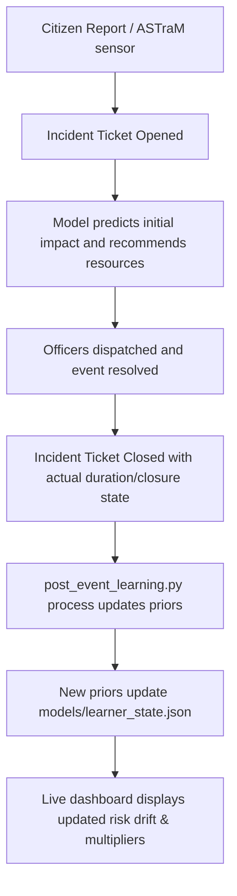

# BTP Post-Event Learning System

The Flipkart Grid 7.0 Problem Statement 2 notes that current traffic intelligence platforms lack a **post-event learning system** to continuously update model priors and resource recommendations. 

This module (`post_event_learning.py`) implements a live recursive feedback loop that learns from every resolved incident, ensuring that BTP’s risk surface adapts dynamically as road conditions, congestion patterns, and seasonal loads evolve.

---

## 1. Core Mathematical Framework

The Post-Event Learner tracks two primary dynamic variables for each of the 23 named corridors in Bengaluru:
1. **Dynamic Risk Score (EMA)**: Tracks the overall incident severity trend.
2. **Bayesian Road Closure Probability**: Updates the likelihood of lane blockages using a conjugate Beta-Binomial update.

### A. Dynamic Risk Score (Exponential Moving Average)
When a traffic event is resolved on corridor $c$, its engineered **Composite Impact Score** (ranging from 0 to 100) is calculated based on its resolved duration, priority, road closure outcome, and cause. The corridor's running risk value is updated recursively:

$$\text{Risk}_t(c) = \alpha \cdot \text{Impact}_t(c) + (1 - \alpha) \cdot \text{Risk}_{t-1}(c)$$

*   **$\alpha$ (Smoothing Factor)**: Default set to `0.1` (10% weight to new events, 90% weight to history). This filters out single-event noise while allowing structural traffic changes (e.g., new metro construction blocks) to shift the baseline risk within 10-15 events.

### B. Bayesian Road Closure Probability
Road closures are sparse but high-impact. Instead of using static historical averages, we model the probability of closure $\theta_c \in [0, 1]$ for corridor $c$ as a random variable following a Beta distribution:

$$\theta_c \sim \text{Beta}(\alpha_c, \beta_c)$$

*   **Priors**: Initialized from training data where:
    $$\alpha_c = \text{historical\_closures}_c + 1$$
    $$\beta_c = \text{historical\_non\_closures}_c + 1$$
*   **Recursive Conjugate Update**: When a new event completes:
    *   If the event **required** a road closure:
        $$\alpha_c \leftarrow \alpha_c + 1$$
    *   If the event **did not** require a road closure:
        $$\beta_c \leftarrow \beta_c + 1$$
*   **Posterior Mean Estimate**: The expected closure probability is computed as:
    $$E[\theta_c] = \frac{\alpha_c}{\alpha_c + \beta_c}$$

---

## 2. Dynamic Risk Drift (Transition Analysis)

The post-event learning loop was initialized on the **Training Set** (events from Nov 2023 to Feb 2028) and continuously updated by streaming the **Test Set** (events from Feb 2028 to Apr 2028).

The top risk drifters (risers and fallers) highlight where traffic conditions shifted structurally:

### Top Risk Risers (Spreading Risk Zones)
*   **Bannerghatta Road**: $+7.4$ drift ($42.9 \rightarrow 50.3$)
    *   *Cause*: Increased density of tree falls, water logging, and utility work.
    *   *Operational Action*: Shift pre-positioned personnel from low-drift sectors here immediately.
*   **Varthur Road**: $+5.5$ drift ($46.1 \rightarrow 51.5$)
    *   *Cause*: Elevated road closure rates (reaching a city-high $11.8\%$).
*   **West of Chord Road**: $+4.0$ drift ($45.5 \rightarrow 49.5$)
*   **Hennur Main Road**: $+4.0$ drift ($45.9 \rightarrow 49.9$)

### Top Risk Fallers (Recovering Zones)
*   **ORR East 1**: $-5.3$ drift ($47.7 \rightarrow 42.4$)
    *   *Observation*: Heavy congestion and potholes resolved during dry spells, leading to lower rolling impact scores.
*   **CBD 2**: $-5.3$ drift ($48.3 \rightarrow 43.0$)
*   **Non-Corridor Zones**: $-3.6$ drift ($36.9 \rightarrow 33.3$)

---

## 3. Class Design & API Usage

The system is encapsulated in the `PostEventLearner` class in `post_event_learning.py`.

```python
from post_event_learning import PostEventLearner
import pandas as pd

# 1. Initialize from historical dataframe
historical_df = pd.read_csv("models/corridor_resource_summary.csv") # or load_raw
learner = PostEventLearner(historical_df, alpha=0.1)

# 2. Process a new resolved event in real-time
new_event = {
    "corridor_clean": "mysore road",
    "impact_score": 68.5,
    "requires_road_closure": True,
    "event_cause": "accident"
}
learner.update(new_event)

# 3. Fetch updated metrics
mysore_risk = learner.get_corridor_risk("mysore road")
mysore_closure_prob = learner.get_closure_probability("mysore road")

print(f"Updated Mysore Road Risk: {mysore_risk:.2f}")
print(f"Updated Closure Probability: {mysore_closure_prob:.2%}")
```

### Serialized State File
The state of the learner is serialized as a lightweight JSON document (`models/learner_state.json`), enabling rapid reloads without reprocessing thousands of rows of historical raw data:
*   **`alpha`**: Rolling decay multiplier.
*   **`ema_risk`**: Current risk score mapping per corridor.
*   **`beta_priors`**: Dict mapping each corridor to its `alpha` and `beta` parameters.
*   **`event_counts`**: Total number of processed incidents.

---

## 4. Production Integration with BTP's ASTraM

In a production environment, the learning loop connects directly to the incident ticketing lifecycle:



### Dispatcher Calibration
When the dispatcher opens the simulator, the resource requirements are scaled by the **dynamic multipliers** that derive from this learning loop. If a corridor's risk drift exceeds $+3.0$ within a week, the system automatically flags it for a "Playbook Upgrade," recommending that the staging of barricades be advanced by 30 minutes.
